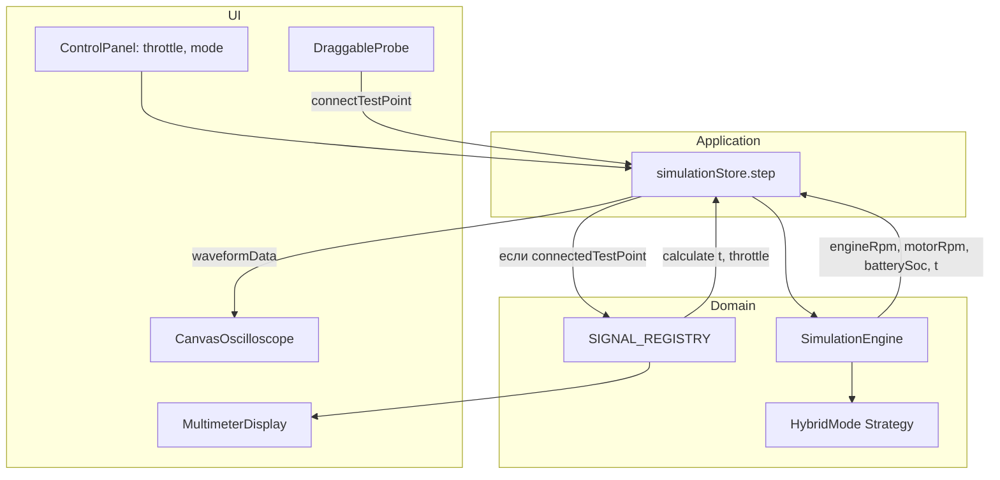
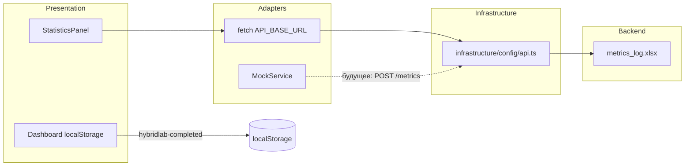

# Hybrid Lab — Описание фронта

Документ описывает **актуальную** реализацию в каталоге `hybrid-lab/` (React + TypeScript + Vite). Старые материалы про один файл `index.html` устарели: приложение перенесено в полноценный SPA.

---

## 1. Назначение

**Hybrid Lab** — интерактивная учебная платформа по гибридным электромобилям (HEV). Два главных модуля:

1. **Лабораторный симулятор** — схема привода, щуп, осциллограф, мультиметр, физика режимов HEV.
2. **Калькулятор TCO** — сравнение полной стоимости владения ДВС, гибрида и электромобиля (не менее важен для защиты проекта).

Дополнительно: глоссарий, литература, топология схемы, диагностика, журнал метрик (Excel через API).

Цель фронтенда — связать **техническое понимание** гибрида с **экономическим обоснованием** выбора автомобиля в одном SPA.

---

## 2. Технологический стек

| Технология | Версия / роль |
|------------|----------------|
| **React** | 19 — UI-компоненты |
| **TypeScript** | 5.9 — строгая типизация, `tsc -b` перед сборкой |
| **Vite** | 7 — dev-сервер и production build |
| **Zustand** | 5 — глобальное состояние без prop drilling |
| **Tailwind CSS** | 4 — утилитарные стили + кастомная тёмная тема |
| **HTML5 Canvas** | Осциллограф, графики TCO |
| **SVG** | Схема гибридной установки |

Сборка: `npm run build` → `dist/`. В Docker образ отдаётся статика через `static-server` на порту **3000**.

---

## 3. Архитектура (Clean Architecture)

Зависимости направлены **внутрь**: UI не содержит физику, домен не знает о React.

```
presentation/     → страницы, компоненты, Canvas, стили
application/      → Zustand-сторы, хуки, игровой цикл
domain/           → физика, режимы гибрида, типы (без React)
infrastructure/   → конфиги модулей, API URL, реестры
core/             → legacy-слой (постепенная миграция в domain/)
```

Подробная схема — в `hybrid-lab/ARCHITECTURE.md`.

### Поток данных симуляции

```
Пользователь (ControlPanel: дроссель, Старт/Пауза, режим)
    ↓
Zustand simulationStore (setThrottle, startSimulation, step)
    ↓
requestAnimationFrame + deltaTime (независимость от FPS)
    ↓
domain/physics/SimulationEngine.step()
    ↓
Strategy: EV | Parallel | Series | Charging
    ↓
Обновление SimulationState → ре-рендер UI
    ↓
Oscilloscope / Multimeter / KPI на дашборде
```

**Ключевой принцип:** шаг физики привязан к `deltaTime` (секунды), а не к кадрам. При просадке FPS расчёты остаются корректными (ограничение `deltaTime` до 50 ms).

---

## 4. Структура каталогов `src/`

```
src/
├── App.tsx                          # Роутинг страниц, дашборд, симулятор
├── main.tsx
├── application/
│   ├── stores/
│   │   ├── simulationStore.ts       # Главный стор симуляции
│   │   ├── progressStore.ts         # Прогресс модулей
│   │   └── uiStore.ts
│   └── hooks/
│       ├── useSimulation.ts         # Game loop (RAF)
│       ├── useHybridMode.ts
│       ├── useEnergyFlow.ts
│       └── useProgress.ts
├── domain/
│   ├── physics/
│   │   ├── SimulationEngine.ts
│   │   ├── SignalRegistry.ts
│   │   └── constants.ts
│   ├── strategies/                  # Strategy Pattern
│   │   ├── EVMode.ts
│   │   ├── ParallelHybridMode.ts
│   │   ├── SeriesHybridMode.ts
│   │   ├── ChargingMode.ts
│   │   └── HybridModeFactory.ts
│   └── types/
├── presentation/
│   ├── components/                  # Oscilloscope, ControlPanel, CircuitSchematic…
│   ├── instruments/                 # MultimeterDisplay
│   ├── pages/                       # TCO, Topology, Glossary, Diagnostics…
│   └── styles/
└── infrastructure/
    └── config/
        ├── api.ts                   # API_BASE_URL
        └── modules.ts               # Учебные модули
```

---

## 5. Ключевые модули и функции

### 5.1. Навигация и страницы (`App.tsx`)

Единое SPA с разделами:

| Страница | Назначение |
|----------|------------|
| **Главная (dashboard)** | Bento-сетка, телеметрия в реальном времени, вход в модули |
| **Симулятор** | Схема, приборы, KPI (SOC, обороты, дроссель) |
| **Калькулятор TCO** | Сравнение стоимости владения ДВС / гибрид / EV |
| **Топология** | Сборка схемы последовательного гибрида (drag-and-drop) |
| **Глоссарий** | Термины HEV с поиском |
| **Литература** | Ссылки на материалы |
| **Диагностика** | Имитация OBD-II / живые данные |

Игровой цикл на странице симулятора встроен в `App`: при `isRunning` вызывается `simulationStore.step(dt)` через `requestAnimationFrame`.

### 5.2. Физический движок (`domain/physics/SimulationEngine.ts`)

- Принимает `deltaTime`, дроссель и текущее `SimulationState`.
- Делегирует расчёт энергопотоков активной **стратегии режима**.
- Возвращает новые RPM, SOC, напряжение, время `t`.

### 5.3. Режимы гибрида (Strategy Pattern)

`HybridModeFactory` создаёт одну из стратегий:

- **EV** — чистый электроход;
- **Hybrid** (Parallel) — параллельный гибрид;
- **Series** — последовательный;
- **Charging** — режим зарядки.

Добавление нового режима: класс → фабрика → union-тип в `HybridMode.ts` — без переписывания всего движка.

### 5.4. Цепочка расчётов: от дросселя до волны на экране

Симулятор разделяет **макро-физику** (обороты, SOC, режимы) и **микро-сигналы** (напряжение на щупе для приборов). Это два связанных, но независимых контура.



**Шаг 1 — игровой цикл** (`App.tsx`, `useSimulation.ts`):

- При `simulationState.isRunning === true` на каждом кадре `requestAnimationFrame` вычисляется `deltaTime` (секунды).
- `deltaTime` ограничивается **50 ms** (`PHYSICS_CONSTANTS.MAX_TIME_STEP`), чтобы при лаге браузера физика не «прыгала».
- Вызывается `simulationStore.step(clampedDeltaTime)`.

**Шаг 2 — физический движок** (`domain/physics/SimulationEngine.ts`):

1. Активная стратегия (`EVMode`, `ParallelHybridMode`, …) считает **распределение энергии**: нагрузка на ДВС, мотор, заряд/разряд батареи.
2. По нагрузке обновляются **обороты ДВС и мотора** с учётом инерции (`ENGINE_INERTIA`, `MOTOR_INERTIA`).
3. Обновляется **SOC** и **напряжение HV-шины** от SOC.
4. Возвращается новое `SimulationState` с увеличенным временем `t`.

**Шаг 3 — буфер осциллографа** (внутри `simulationStore.step`):

Если щуп подключён (`connectedTestPoint !== null`):

```typescript
const entry = SIGNAL_REGISTRY[testPointId];
const testValue = entry.calculate(newState.t, throttle);
newWaveformData = [...waveformData.slice(-511), testValue]; // макс. 512 сэмплов
```

Если щуп отключён — буфер не пополняется (волна не строится).

**Шаг 4 — отображение:**

- **Осциллограф** читает массив `waveformData` и рисует последние N точек.
- **Мультиметр** вызывает ту же `calculate(t, throttle)` «на лету» для мгновенного значения на дисплее.

Таким образом, осциллограф показывает **историю**, мультиметр — **текущий сэмпл**; оба опираются на один реестр сигналов.

---

### 5.5. Signal Registry — единый источник сигналов

Файл: `domain/physics/SignalRegistry.ts`

Паттерн **Registry** заменяет разветвления `if (point === 'battery')`. Каждая тестовая точка — объект:

| ID | Метка | Цвет | Формула (упрощённо) |
|----|-------|------|---------------------|
| `battery` | BATTERY | cyan | ~144 V + синус от `t` + шум, зависит от дросселя |
| `motor` | MOTOR | green | ~120 V, синусоида с частотой выше |
| `engine` | ICE | amber | ~12 V, пульсация от оборотов ДВС |
| `generator` | GENERATOR | violet | ~48 V от дросселя + синус |

```typescript
export interface SignalRegistryEntry {
  label: string;
  color: string;
  unit: string;
  calculate: (t: number, throttle: number) => number;
}
```

**Почему отдельно от SimulationEngine:** напряжение на щупе — **учебная модель осциллографа** (как на стенде Electude), а не прямой вывод законов Ньютона. Это позволяет менять «характер» сигнала без переписывания физики RPM/SOC.

**Расширение:** добавить точку `inverter` = одна запись в `SIGNAL_REGISTRY` + координата в `TEST_POINT_COORDS`.

---

### 5.6. Щуп (DraggableProbe) — логика подключения

Файл: `presentation/components/DraggableProbe.tsx`

Щуп — HTML-элемент поверх SVG-схемы (`CircuitSchematic`). Координаты схемы заданы в **пространстве viewBox** (700×280), а щуп двигается в **пикселях контейнера**.

**Преобразование координат:**

```typescript
// clientX/Y → SVG viewBox
x = (clientX - rect.left) * (svgViewBox.width / rect.width)
y = (clientY - rect.top) * (svgViewBox.height / rect.height)
```

**Snap (прилипание):** радиус `SNAP_RADIUS_SVG = 45` единиц viewBox. При перетаскивании ищется ближайшая точка из `TEST_POINT_COORDS` (BATT, MOTOR, ICE, GEN).

**Цветовая индикация состояния:**

| Состояние | Цвет щупа | Условие |
|-----------|-----------|---------|
| Свободен | серый `#64748b` | не у точки |
| Рядом с точкой | жёлтый `#fbbf24` | в радиусе snap, ещё не отпущена кнопка |
| Подключён | красный `#ef4444` | `connectedPoint` задан в store |

**При отпускании мыши (`mouseup`):**

- Если есть точка в радиусе → `onConnect(pointId)`, щуп **привязывается** к координатам точки, `waveformData` **очищается** (новая серия измерений).
- Если нет → `onDisconnect()`, буфер волны сбрасывается.

**Техническая деталь:** во время drag на щуп вешается `pointer-events: none`, чтобы события мыши проходили к SVG под ним — иначе snap работает некорректно (исправление задокументировано в коде).

Координаты точек экспортируются из `CircuitSchematic.tsx`:

```typescript
export const TEST_POINT_COORDS = {
  battery:   { x: 110, y: 90,  label: 'BATT' },
  motor:     { x: 328, y: 90,  label: 'MOTOR' },
  engine:    { x: 110, y: 210, label: 'ICE' },
  generator: { x: 180, y: 210, label: 'GEN' },
};
```

---

### 5.7. Осциллограф — прорисовка на Canvas

Файл: `presentation/components/Oscilloscope.tsx`

#### 5.7.1. Зачем два цикла: физика и отрисовка

- **Симуляция** обновляет `waveformData` в store с частотой game loop (~60 Hz при нормальном FPS).
- **Отрисовка** — отдельный `requestAnimationFrame` внутри осциллографа, тоже ~60 FPS, но **не перезапускается** при каждом новом сэмпле.

Это паттерн **`dataRef`**: React-проп `data` копируется в `dataRef.current`, а функция `drawOscilloscope` читает ref. Иначе при каждом обновлении массива пересоздавался бы effect RAF → мерцание и лишняя нагрузка.

#### 5.7.2. HiDPI (Retina)

```typescript
const dpr = window.devicePixelRatio || 1;
canvas.width = rect.width * dpr;
canvas.height = rect.height * dpr;
ctx.scale(dpr, dpr);
```

Внутренний буфер canvas в физических пикселях больше CSS-размера → линия волны остаётся чёткой на экранах с DPR 2–3.

#### 5.7.3. Слои кадра (порядок отрисовки)

1. **Фон** — `#09090b`.
2. **Сетка** — вертикальные/горизонтальные линии каждые 20 px, цвет `#2d5f6f`.
3. **Оси** — горизонталь (ноль вольт) и вертикаль развёртки (1/4 ширины).
4. **Волна** — только если `data.length > 1`.
5. **Шкала напряжения** — подписи `0…4 × voltsPerDiv` справа.
6. **Шкала времени** — подписи `0…4 × timebase` мс снизу.
7. **Оверлей** — база развёртки, статус щупа, счётчик сэмплов.

#### 5.7.4. Математика волны

Параметры по умолчанию на странице симулятора: `timebase={1}` мс/дел, `voltsPerDiv={20}` V/дел.

```typescript
const pointsToShow = Math.min(currentData.length, width);  // не больше ширины canvas в px
const scale = height / (voltsPerDiv * 8);                  // 8 делений по вертикали
const centerY = height / 2;

for (let i = 0; i < pointsToShow; i++) {
  const value = currentData[currentData.length - pointsToShow + i];
  const x = (i / pointsToShow) * width;           // время → ось X (слева направо = «сейчас» справа)
  const y = centerY - value * scale;            // напряжение → ось Y (вверх = больше V)
}
```

- Берутся **последние** `pointsToShow` сэмплов — осциллограф ведёт себя как прибор с бегущей развёрткой.
- Линия рисуется `strokeStyle: #22d3ee`, толщина 2 px.
- Без подключённого щупа массив пуст → отображаются только сетка и надпись «Щуп отключен».

#### 5.7.5. Ограничение частоты перерисовки

```typescript
if (now - lastDrawTimeRef.current >= 1000 / 60) {
  drawOscilloscope();
}
```

Даже если RAF вызывается чаще 60 Hz, canvas перерисовывается не чаще **60 раз в секунду**.

При `resize` окна вызывается `drawOscilloscope` для пересчёта размеров.

---

### 5.8. Мультиметр и панель управления

**MultimeterDisplay** (`presentation/instruments/MultimeterDisplay.tsx`):

- Получает `connectedPoint`, `simulationTime` (`t`), `throttle`.
- Берёт `SIGNAL_REGISTRY[connectedPoint]` и вызывает `calculate(simulationTime, throttle)`.
- LCD-стиль: 3 знака после запятой, единица `V`, метка точки (BATTERY / MOTOR / …).
- Кнопки «ПЕРЕМ/ПОСТ» и «ДИАПАЗОН» — UI-заготовки под расширение (сейчас disabled).

**ControlPanel** — дроссель 0–100 %, Старт/Пауза, переключатель режима гибрида (`setHybridMode` → смена стратегии в движке).

---

### 5.9. Журнал данных и адаптеры

Платформа использует **слой адаптеров**, чтобы UI не зависел от того, откуда приходят данные: mock, REST API или localStorage.



#### 5.9.1. API-адаптер (production)

Файл: `infrastructure/config/api.ts`

```typescript
export const API_BASE_URL =
  import.meta.env.VITE_API_BASE_URL ?? 'https://hybrid-lab.duckdns.org/api';
```

**StatisticsPanel** — адаптер «скачать журнал»:

- `GET ${API_BASE_URL}/download` → blob → программный клик по `<a download="metrics_log.xlsx">`.
- Ошибки сети → `alert` пользователю.

Компонент готов и использует те же поля, что и backend (`pid_0d`, `hv_soc`, …), когда будет подключена отправка.

> Сейчас `StatisticsPanel` реализован в коде; для отображения на странице симулятора его можно добавить в layout `SimulatorPage` в `App.tsx`.

#### 5.9.2. MockService — адаптер разработки

Файл: `shared/services/MockService.ts`

Заглушка с тем же **контрактом**, что ожидает будущий backend:

| Метод | Назначение |
|-------|------------|
| `getSimulatorConfig()` | Параметры источников сигналов (частота, шум) |
| `getModules()` | Список учебных модулей |
| `saveUserProgress` / `getUserProgress` | Прогресс (сейчас `localStorage`) |
| `logSimulationMetrics()` | Заготовка под `POST /metrics` |

Переключение mock → API: заменить вызовы `MockService` на `fetch(API_BASE_URL + '/metrics', { method: 'POST', body })` без изменения компонентов приборов.

#### 5.9.3. Локальный журнал прогресса

На главной странице прогресс модулей читается из `localStorage.getItem('hybridlab-completed')` — массив ID пройденных модулей (`ice`, `electric`, `modes`). Это **клиентский журнал обучения**, не путать с Excel-метриками на сервере.

#### 5.9.4. Что попадает в серверный журнал (концепция)

При интеграции `POST /metrics` с симулятора в Excel уйдут, например:

- скорость (из оборотов / модели);
- `pid_0c` ← `engineRpm`;
- `hv_soc` ← `batterySoc`;
- `hv_volt` ← `batteryVoltage`;
- момент мотора — из режима и дросселя.

Фронт выступает **продюсером телеметрии**, бэкенд — **потребителем и архивом**.

---

### 5.10. Калькулятор TCO — равноценный учебный модуль

**TCO (Total Cost of Ownership)** — расчёт полной стоимости владения автомобилем. Для курса по гибридам это не «дополнение к симулятору», а **второй столп платформы**: симулятор отвечает на вопрос «как работает система», TCO — «выгоден ли гибрид экономически».

Файлы:

- `presentation/pages/TCOCalculator.tsx` — UI и формулы;
- `presentation/instruments/canvas/tcoChart.ts` — отрисовка столбчатой диаграммы.

#### 5.10.1. Три профиля автомобиля

| Профиль | Покупка | Топливо л/100 км | Электр. кВт·ч/100 км | ТО/год |
|---------|---------|------------------|----------------------|--------|
| **ДВС (ICE)** | 1,5 млн ₽ | 9 | 0 | 80 000 ₽ |
| **Гибрид (HEV)** | 2,0 млн ₽ | 5 | 1,5 | 70 000 ₽ |
| **Электро (EV)** | 2,8 млн ₽ | 0 | 17 | 40 000 ₽ |

#### 5.10.2. Формула TCO

Ввод пользователя (слайдеры):

- годовой пробег (км);
- цена топлива (₽/л);
- цена электричества (₽/кВт·ч);
- срок владения (лет).

```typescript
fuelCostPerYear = (annualKm / 100) * fuelConsumptionPer100km * fuelPricePerL;
electricCostPerYear = (annualKm / 100) * electricConsumptionPer100km * electricityPricePerKwh;
total = purchasePrice + (fuel + electric) * years + maintenanceBase * years;
```

Итог разбивается на **покупку**, **топливо/энергию**, **ТО** — студент видит структуру затрат, а не одну цифру.

#### 5.10.3. Визуализация

- **Canvas-диаграмма** (`drawTCOChart`) — три столбца, сетка по Y, подписи в млн ₽, HiDPI через `devicePixelRatio`.
- **ResizeObserver** — при изменении ширины контейнера график пересчитывается без переполнения layout.
- Карточки с меткой «★ выгоднее» у минимального TCO.
- Синхронное обновление таблицы и графика при движении слайдеров.

#### 5.10.4. Педагогическая ценность на защите

| Симулятор | Калькулятор TCO |
|-----------|-----------------|
| Физика, приборы, режимы HEV | Экономика, сравнение технологий |
| «Что происходит под капотом» | «Сколько стоит владение за 5 лет» |
| Инженер-диагност | Покупатель / fleet-менеджер |

На защите имеет смысл показать **оба модуля подряд**: сначала симулятор (техника), затем TCO — изменить пробег и цену бензина, показать, при каких условиях гибрид обгоняет ДВС по совокупным затратам.

---

### 5.11. Состояние (Zustand)

`simulationStore` хранит:

- `simulationState`: `t`, `throttle`, `engineRpm`, `motorRpm`, `batterySoc`, `batteryVoltage`, `mode`, `waveformData`, `connectedTestPoint`, `testPointValue`, `isRunning`;
- действия: `setThrottle`, `startSimulation`, `pauseSimulation`, `step`, `connectTestPoint`, `disconnectTestPoint`, `setHybridMode`.

Отдельно `progressStore` и `localStorage` (`hybridlab-completed`) для учебного прогресса.

---


## 6. Интеграция с backend

Конфигурация: `src/infrastructure/config/api.ts`

```typescript
export const API_BASE_URL =
  import.meta.env.VITE_API_BASE_URL ?? 'https://hybrid-lab.duckdns.org/api';
```

| Сценарий | URL |
|----------|-----|
| Production (один домен, HTTPS) | `https://hybrid-lab.duckdns.org/api` |
| Локальная разработка | `.env`: `VITE_API_BASE_URL=http://localhost:8000` |

**Реализованный вызов:** `StatisticsPanel` → `GET ${API_BASE_URL}/download` → файл `metrics_log.xlsx`.

Nginx на сервере проксирует `/api/*` на контейнер backend (порт 8000). Браузер обращается только к HTTPS-домену — без mixed content.

> Эндпоинт `POST /metrics` на бэкенде готов принимать телеметрию; подключение отправки с фронта — следующий шаг интеграции.

---

## 7. UI/UX

- **Glassmorphism** — полупрозрачные панели, `backdrop-filter`.
- **Тёмная тема** с акцентами: indigo, emerald, amber, cyan, violet.
- **ArcGauge** — дуговые индикаторы KPI.
- **Адаптивная сетка** — bento-layout на главной, 2-колоночный симулятор.

Дизайн ориентирован на «лабораторный» стиль учебных стендов (Electude-подобный опыт).

---

## 8. Сборка и деплой

```bash
cd hybrid-lab
npm install
npm run dev      # разработка, http://localhost:5173
npm run build    # tsc + vite build → dist/
npm run lint     # ESLint
```

Docker (из корня репозитория):

```yaml
frontend:
  build: ./hybrid-lab
  ports:
    - "3000:3000"
```

Production: статика из `dist/`, API за reverse proxy на том же домене.

---

## 9. Сценарий демонстрации на защите (7–10 мин)

### Блок A — Симулятор и приборы (~4 мин)

1. **Главная** — live-телеметрия (SOC, обороты) при активной симуляции.
2. **Симулятор** — Старт, дроссель, переключение Hybrid / EV / Series; объяснить, что RPM и SOC считает `SimulationEngine`, а не анимация.
3. **Щуп** — перетащить на MOTOR (жёлтый → красный snap), показать рост `waveformData` и волну на осциллографе.
4. **Мультиметр** — то же подключение: мгновенное значение в вольтах с той же формулой `SIGNAL_REGISTRY`.
5. **Код** — `SignalRegistry.ts` + фрагмент `simulationStore.step` (строки с `slice(-511)`).

### Блок B — Калькулятор TCO (~3 мин)

6. Открыть **Калькулятор TCO** с главной (bento-карточка).
7. Увеличить пробег до 40 000 км/год и цену топлива — показать, как меняются столбцы на Canvas.
8. Показать расшифровку: покупка vs топливо vs ТО; отметить метку «выгоднее».
9. Сформулировать вывод: *«Симулятор учит устройству HEV, TCO — экономическому выбору между ICE, HEV и EV»*.

### Блок C — Данные и инфраструктура (~2 мин)

10. **Журнал** — `API_BASE_URL`, скачивание Excel (`/download`), упомянуть `MockService` как слой до полной отправки `POST /metrics`.
11. **Деплой** — Docker + Nginx + HTTPS `hybrid-lab.duckdns.org`.

---

## 10. Ответы на типичные вопросы жюри

**Почему не один HTML-файл, а React?**  
Масштабируемость: десятки экранов, переиспользуемые компоненты, типизация, сборка, Docker. Учебная платформа растёт без «спагетти» в одном файле.

**Как обеспечена независимость физики от FPS?**  
`deltaTime` в секундах на каждом кадре `requestAnimationFrame`, ограничение максимального шага 50 ms.

**Зачем Signal Registry?**  
Паттерн «реестр» вместо switch: новая точка измерения = одна запись в объекте, единый интерфейс `calculate(t, throttle)`. Осциллограф и мультиметр используют один источник правды.

**Почему осциллограф не перезапускает RAF при каждом сэмпле?**  
Паттерн `dataRef`: данные обновляются в store, цикл отрисовки читает актуальный массив без размонтирования effect — стабильные 60 FPS отрисовки.

**Чем мультиметр отличается от осциллографа?**  
Мультиметр показывает `calculate(t, throttle)` сейчас; осциллограф — буфер из 512 последних значений, прокручиваемый слева направо.

**Зачем TCO, если есть симулятор?**  
Разные компетенции: техническая диагностика vs финансовое обоснование гибрида. На рынке оба навыка нужны (СТО + консультация клиента).

**Что такое адаптеры на фронте?**  
`api.ts` + `fetch` для production, `MockService` для dev/заглушек, `localStorage` для прогресса — UI не привязан к конкретному хранилищу.

**Почему Zustand, а не Redux?**  
Минимальный boilerplate, достаточно для симуляции и UI; store рядом с доменной логикой.

**Как фронт работает с HTTPS и одним доменом?**  
`API_BASE_URL` указывает на `/api` того же origin; Nginx терминирует SSL и проксирует на backend.

---

## 11. Итоги (для слайда)

| Критерий | Реализация |
|----------|-------------|
| Архитектура | Clean Architecture, Strategy, Factory, Registry |
| Симуляция | deltaTime, 4 режима HEV, щуп + snap, буфер 512 сэмплов |
| Приборы | Canvas-осциллограф (HiDPI, dataRef), мультиметр, Signal Registry |
| Экономика | Калькулятор TCO: 3 профиля, Canvas-диаграмма, слайдеры |
| Данные | API-адаптер, MockService, Excel-журнал, localStorage прогресс |
| Обучение | 7 разделов, модули, топология, глоссарий |
| Production | Vite build, Docker, HTTPS API через reverse proxy |

**Hybrid Lab Frontend** — учебная платформа с двумя равноправными ядрами: **лабораторный симулятор** (физика и приборы) и **финансовый модуль TCO** (обоснование выбора силовой установки), плюс слой адаптеров для журналирования и деплоя в production.
